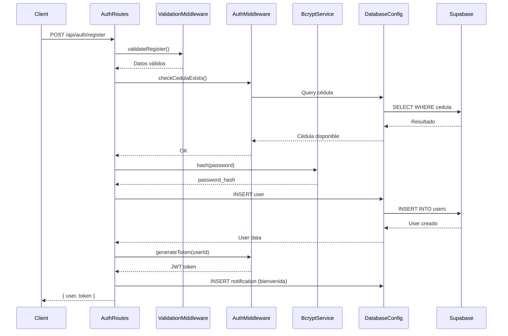

# Diagramas C4 - GestiónUM
## Sistema de Gestión Universitaria

**Versión:** 1.0  
**Fecha:** 2024  
**Autor:** Equipo de Desarrollo GestiónUM

---

## Introducción

Este documento contiene los diagramas C4 del sistema GestiónUM. Los diagramas C4 son una técnica de modelado de software que describe la arquitectura de un sistema en 4 niveles de abstracción:

1. **Nivel 1 - Contexto:** Vista de alto nivel del sistema y sus interacciones con usuarios y sistemas externos
2. **Nivel 2 - Contenedores:** Descomposición del sistema en contenedores (aplicaciones, bases de datos, sistemas de archivos, etc.)
3. **Nivel 3 - Componentes:** Descomposición de un contenedor en componentes (módulos, servicios, etc.)
4. **Nivel 4 - Código:** Descomposición de un componente en clases (opcional, solo para componentes críticos)

Los diagramas están en formato **Mermaid**, que puede renderizarse en:
- GitHub/GitLab (automáticamente)
- VS Code (con extensión Mermaid)
- Herramientas online (mermaid.live)
- Documentación (con plugins)

---

## Nivel 1: Diagrama de Contexto

### Descripción

El diagrama de contexto muestra el sistema GestiónUM en su entorno, identificando los usuarios y sistemas externos con los que interactúa.

### Diagrama


### Descripción de Relaciones

| Relación | Descripción | Protocolo |
|----------|-------------|-----------|
| Estudiante → GestiónUM | Los estudiantes usan el sistema para gestionar horarios y citas | HTTPS |
| GestiónUM → Supabase | El sistema almacena y consulta todos los datos (usuarios, horarios, citas, notificaciones) | HTTPS/REST API |
| GestiónUM → Expo Notifications | El sistema envía notificaciones push a los dispositivos móviles | HTTPS/API |

### Tecnologías Clave

- **Frontend:** React Native con Expo (iOS, Android, Web)
- **Backend:** Node.js con Express.js
- **Base de Datos:** PostgreSQL (a través de Supabase)
- **Notificaciones:** Expo Notifications Service

---

## Nivel 2: Diagrama de Contenedores

### Descripción

El diagrama de contenedores descompone el sistema GestiónUM en sus contenedores principales: aplicaciones frontend, backend API, base de datos y servicios externos.

### Diagrama


### Descripción de Contenedores

| Contenedor | Tecnología | Responsabilidad |
|------------|-----------|-----------------|
| **Aplicación Móvil** | React Native, Expo | Interfaz de usuario para dispositivos móviles (iOS/Android). Gestiona la UI y comunicación con el backend. |
| **Aplicación Web** | React Native Web | Interfaz de usuario para navegadores web. Comparte código con la app móvil. |
| **API Backend** | Node.js, Express.js | Procesa peticiones HTTP, ejecuta lógica de negocio, valida datos, autentica usuarios, gestiona asignación de citas. |
| **Supabase Database** | PostgreSQL | Almacena todos los datos persistentes: usuarios, horarios, citas, notificaciones, slots disponibles. |
| **Expo Notifications** | Cloud Service | Proporciona servicio de notificaciones push para dispositivos móviles. |

### Decisiones Técnicas

- **Frontend Multiplataforma:** React Native permite compartir código entre móvil y web
- **API REST:** Estándar de la industria, fácil de consumir y mantener
- **Base de Datos Externa:** Supabase proporciona escalabilidad y gestión automática
- **Notificaciones Externas:** Expo Notifications simplifica el envío de push notifications

---

## Nivel 3: Diagrama de Componentes (API Backend)

### Descripción

El diagrama de componentes descompone el contenedor API Backend en sus componentes principales: rutas, middleware, configuración y servicios.

### Diagrama

```mermaid
C4Component
    title Diagrama de Componentes - API Backend

    Container(api, "API Backend", "Node.js, Express.js", "API REST del sistema")
    
    Component_Boundary(api_boundary, "API Backend") {
        Component(server, "Server", "Express.js", "Servidor HTTP principal. Configura middleware, rutas y manejo de errores.")
        
        Component(auth_routes, "Auth Routes", "Express Router", "Gestiona autenticación: registro, login, verificación, logout")
        Component(schedule_routes, "Schedule Routes", "Express Router", "Gestiona horarios académicos: CRUD completo")
        Component(appointment_routes, "Appointment Routes", "Express Router", "Gestiona citas psicológicas: solicitar, cancelar, reprogramar")
        Component(notification_routes, "Notification Routes", "Express Router", "Gestiona notificaciones: consultar, marcar como leída, eliminar")
        Component(profile_routes, "Profile Routes", "Express Router", "Gestiona perfil de usuario: consultar, actualizar")
        
        Component(auth_middleware, "Auth Middleware", "JavaScript", "Autenticación JWT, generación de tokens, verificación de usuarios")
        Component(validation_middleware, "Validation Middleware", "express-validator", "Validación de datos de entrada, sanitización")
        
        Component(security_middleware, "Security Middleware", "helmet, cors, rate-limit", "Protección HTTP, CORS, rate limiting")
        
        Component(database_config, "Database Config", "Supabase Client", "Configuración y cliente de Supabase para acceso a base de datos")
    }
    
    System_Ext(supabase_db, "Supabase Database", "PostgreSQL")
    
    Rel(server, auth_routes, "Usa")
    Rel(server, schedule_routes, "Usa")
    Rel(server, appointment_routes, "Usa")
    Rel(server, notification_routes, "Usa")
    Rel(server, profile_routes, "Usa")
    Rel(server, security_middleware, "Usa")
    
    Rel(auth_routes, auth_middleware, "Usa")
    Rel(auth_routes, validation_middleware, "Usa")
    Rel(auth_routes, database_config, "Usa")
    
    Rel(schedule_routes, auth_middleware, "Usa")
    Rel(schedule_routes, validation_middleware, "Usa")
    Rel(schedule_routes, database_config, "Usa")
    
    Rel(appointment_routes, auth_middleware, "Usa")
    Rel(appointment_routes, validation_middleware, "Usa")
    Rel(appointment_routes, database_config, "Usa")
    
    Rel(notification_routes, auth_middleware, "Usa")
    Rel(notification_routes, database_config, "Usa")
    
    Rel(profile_routes, auth_middleware, "Usa")
    Rel(profile_routes, validation_middleware, "Usa")
    Rel(profile_routes, database_config, "Usa")
    
    Rel(database_config, supabase_db, "Lee y escribe", "HTTPS/PostgREST API")
    
    UpdateLayoutConfig($c4ShapeInRow="3", $c4BoundaryInRow="1")
```

### Descripción de Componentes

#### Componentes de Rutas (Routes)

| Componente | Responsabilidad | Endpoints Principales |
|-----------|----------------|---------------------|
| **Auth Routes** | Gestión de autenticación y autorización | POST /api/auth/register<br>POST /api/auth/login<br>GET /api/auth/verify<br>POST /api/auth/logout |
| **Schedule Routes** | Gestión de horarios académicos | GET /api/schedules<br>POST /api/schedules<br>PUT /api/schedules/:id<br>DELETE /api/schedules/:id<br>GET /api/schedules/dashboard/weekly-summary |
| **Appointment Routes** | Gestión de citas psicológicas | GET /api/appointments<br>POST /api/appointments/request<br>GET /api/appointments/next<br>POST /api/appointments/:id/cancel<br>POST /api/appointments/:id/reschedule |
| **Notification Routes** | Gestión de notificaciones | GET /api/notifications<br>GET /api/notifications/unread<br>PUT /api/notifications/:id/read<br>PUT /api/notifications/mark-all-read<br>DELETE /api/notifications/:id |
| **Profile Routes** | Gestión de perfil de usuario | GET /api/profile<br>PUT /api/profile |

#### Componentes de Middleware

| Componente | Responsabilidad | Tecnología |
|-----------|----------------|------------|
| **Auth Middleware** | Autenticación JWT, generación de tokens, verificación de usuarios | jsonwebtoken, bcryptjs |
| **Validation Middleware** | Validación y sanitización de datos de entrada | express-validator |
| **Security Middleware** | Protección HTTP (headers), CORS, rate limiting | helmet, cors, express-rate-limit |

#### Componentes de Configuración

| Componente | Responsabilidad | Tecnología |
|-----------|----------------|------------|
| **Database Config** | Configuración y cliente de Supabase | @supabase/supabase-js |
| **Server** | Configuración del servidor Express, middleware global, manejo de errores | Express.js |

### Flujos de Datos Principales

#### Flujo de Autenticación
1. Cliente → Auth Routes: POST /api/auth/login
2. Auth Routes → Validation Middleware: Valida datos
3. Auth Routes → Database Config: Consulta usuario
4. Database Config → Supabase: Query a base de datos
5. Auth Routes → Auth Middleware: Genera token JWT
6. Auth Routes → Cliente: Retorna token y datos de usuario

#### Flujo de Solicitud de Cita
1. Cliente → Appointment Routes: POST /api/appointments/request
2. Appointment Routes → Auth Middleware: Verifica token
3. Appointment Routes → Database Config: Busca slots disponibles
4. Database Config → Supabase: Query de slots y citas existentes
5. Appointment Routes: Lógica de asignación automática
6. Appointment Routes → Database Config: Crea cita y notificación
7. Appointment Routes → Cliente: Retorna cita creada

---

## Nivel 4: Diagrama de Código (Módulo de Autenticación)

### Descripción

El diagrama de código muestra las clases principales dentro del componente Auth Routes y Auth Middleware. Este nivel es opcional y solo se incluye para componentes críticos o complejos.

### Diagrama


### Descripción de Clases

#### AuthRoutes
- **Responsabilidad:** Gestiona los endpoints de autenticación (registro, login, verificación, logout)
- **Métodos Principales:**
  - `register()`: Registra un nuevo usuario, hashea la contraseña, genera token
  - `login()`: Autentica usuario, verifica contraseña, genera token
  - `verify()`: Verifica si un token JWT es válido
  - `logout()`: Invalida sesión (futuro: blacklist de tokens)

#### AuthMiddleware
- **Responsabilidad:** Middleware para autenticación y autorización
- **Métodos Principales:**
  - `authenticateToken()`: Middleware que verifica JWT en cada request
  - `optionalAuth()`: Middleware opcional (no falla si no hay token)
  - `generateToken()`: Genera token JWT con userId
  - `checkCedulaExists()`: Verifica si una cédula ya está registrada

#### ValidationMiddleware
- **Responsabilidad:** Validación de datos de entrada
- **Métodos Principales:**
  - `validateRegister()`: Valida datos de registro (cédula, email, contraseña, etc.)
  - `validateLogin()`: Valida datos de login (cédula, contraseña)

#### DatabaseConfig
- **Responsabilidad:** Configuración y acceso a Supabase
- **Propiedades:**
  - `supabase`: Cliente para operaciones normales
  - `supabaseAdmin`: Cliente para operaciones administrativas
- **Métodos:**
  - `getSupabase()`: Retorna cliente normal
  - `getSupabaseAdmin()`: Retorna cliente administrativo

#### Servicios Auxiliares

**BcryptService:**
- `hash()`: Hashea contraseñas con bcrypt (12 salt rounds)
- `compare()`: Compara contraseña plana con hash

**JWTService:**
- `sign()`: Genera token JWT
- `verify()`: Verifica y decodifica token JWT

#### Modelos de Datos

**UserModel:**
- Representa la estructura de datos de un usuario en la base de datos
- Campos: id, cedula, password_hash, nombre, apellido, email, programa, semestre, telefono

### Flujo de Registro (Ejemplo)



---

## Diagrama Adicional: Componentes Frontend

### Descripción

Este diagrama complementario muestra la estructura de componentes del frontend (aplicación móvil y web).

### Diagrama

```mermaid
C4Component
    title Diagrama de Componentes - Frontend (Móvil/Web)

    Container(app, "Aplicación Frontend", "React Native, Expo", "Aplicación móvil y web")
    
    Component_Boundary(frontend_boundary, "Frontend") {
        Component(app_component, "App Component", "React", "Componente raíz. Gestiona navegación y providers.")
        
        Component(auth_context, "Auth Context", "React Context", "Gestiona estado de autenticación global")
        Component(auth_navigator, "Auth Navigator", "React Navigation", "Navegación para usuarios no autenticados")
        Component(app_navigator, "App Navigator", "React Navigation", "Navegación para usuarios autenticados")
        
        Component(login_screen, "Login Screen", "React Native", "Pantalla de inicio de sesión")
        Component(register_screen, "Register Screen", "React Native", "Pantalla de registro")
        
        Component(schedules_screen, "Schedules Screen", "React Native", "Pantalla de gestión de horarios")
        Component(appointments_screen, "Appointments Screen", "React Native", "Pantalla de gestión de citas")
        Component(notifications_screen, "Notifications Screen", "React Native", "Pantalla de notificaciones")
        Component(profile_screen, "Profile Screen", "React Native", "Pantalla de perfil")
        
        Component(api_service, "API Service", "Axios", "Cliente HTTP para comunicación con backend")
        
        Component(async_storage, "AsyncStorage", "React Native", "Almacenamiento local de tokens y datos")
    }
    
    System_Ext(backend_api, "Backend API", "Node.js, Express.js")
    
    Rel(app_component, auth_context, "Usa")
    Rel(app_component, auth_navigator, "Usa")
    Rel(app_component, app_navigator, "Usa")
    
    Rel(auth_navigator, login_screen, "Navega a")
    Rel(auth_navigator, register_screen, "Navega a")
    
    Rel(app_navigator, schedules_screen, "Navega a")
    Rel(app_navigator, appointments_screen, "Navega a")
    Rel(app_navigator, notifications_screen, "Navega a")
    Rel(app_navigator, profile_screen, "Navega a")
    
    Rel(login_screen, auth_context, "Usa")
    Rel(register_screen, auth_context, "Usa")
    Rel(schedules_screen, api_service, "Usa")
    Rel(appointments_screen, api_service, "Usa")
    Rel(notifications_screen, api_service, "Usa")
    Rel(profile_screen, api_service, "Usa")
    
    Rel(auth_context, api_service, "Usa")
    Rel(auth_context, async_storage, "Usa")
    
    Rel(api_service, backend_api, "Realiza peticiones", "HTTPS/REST")
    
    UpdateLayoutConfig($c4ShapeInRow="3", $c4BoundaryInRow="1")
```

### Descripción de Componentes Frontend

| Componente | Responsabilidad | Tecnología |
|------------|----------------|------------|
| **App Component** | Componente raíz, gestiona providers y navegación principal | React |
| **Auth Context** | Context API para estado de autenticación global | React Context |
| **Auth Navigator** | Navegación para usuarios no autenticados (login, registro) | React Navigation |
| **App Navigator** | Navegación principal para usuarios autenticados | React Navigation |
| **Screens** | Pantallas de la aplicación (Login, Register, Schedules, Appointments, etc.) | React Native |
| **API Service** | Cliente HTTP centralizado para todas las peticiones al backend | Axios |
| **AsyncStorage** | Almacenamiento local de tokens y datos de usuario | React Native AsyncStorage |

---

## Notas sobre los Diagramas

### Convenciones Utilizadas

1. **Colores y Formas:**
   - Personas: Amarillo
   - Sistemas: Azul
   - Contenedores: Verde
   - Componentes: Naranja
   - Bases de datos: Rosa

2. **Relaciones:**
   - Las flechas indican dirección de la relación
   - Las etiquetas describen el tipo de interacción
   - Los protocolos se especifican cuando son relevantes

3. **Niveles de Detalle:**
   - Nivel 1: Vista de alto nivel para stakeholders
   - Nivel 2: Vista técnica para arquitectos y desarrolladores
   - Nivel 3: Vista detallada para desarrolladores del backend
   - Nivel 4: Vista de implementación para desarrolladores específicos

### Herramientas para Visualizar

Los diagramas Mermaid pueden visualizarse en:

1. **GitHub/GitLab:** Se renderizan automáticamente en archivos .md
2. **VS Code:** Con la extensión "Markdown Preview Mermaid Support"
3. **Online:** https://mermaid.live (editor interactivo)
4. **Documentación:** Con plugins de Mermaid para herramientas de documentación

### Mantenimiento

Estos diagramas deben actualizarse cuando:
- Se agreguen nuevos componentes o contenedores
- Cambien las tecnologías utilizadas
- Se modifiquen las interacciones entre componentes
- Se agreguen nuevos sistemas externos

---

## Referencias

- [C4 Model - Simon Brown](https://c4model.com/)
- [Mermaid Documentation](https://mermaid.js.org/)
- Documento de Contexto y Alcance del Sistema
- Documento de Drivers, Requisitos y Restricciones

---

## Historial de Versiones

| Versión | Fecha | Autor | Cambios |
|---------|-------|-------|---------|
| 1.0 | 2024 | Equipo de Desarrollo | Versión inicial de los diagramas C4 |

---

**Fin del Documento**

